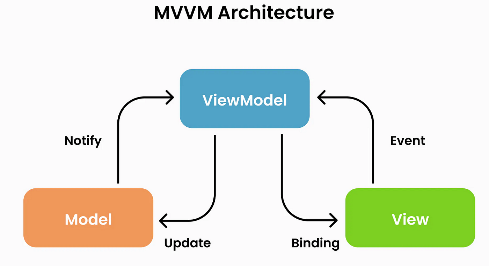
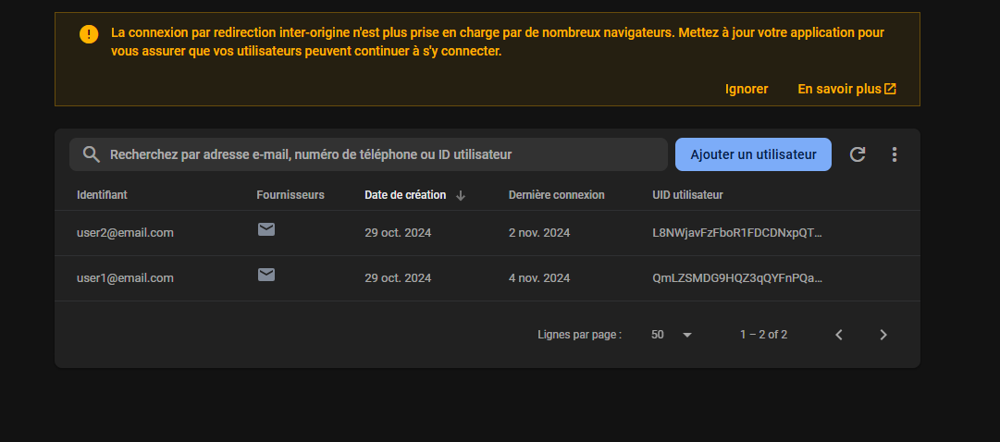
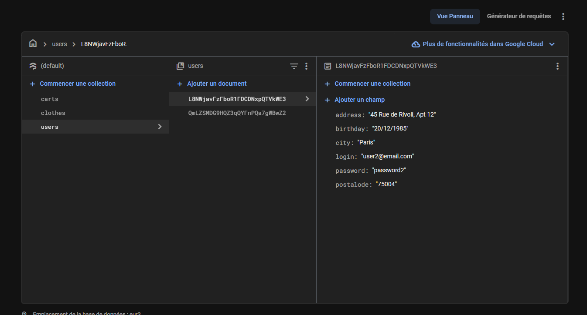
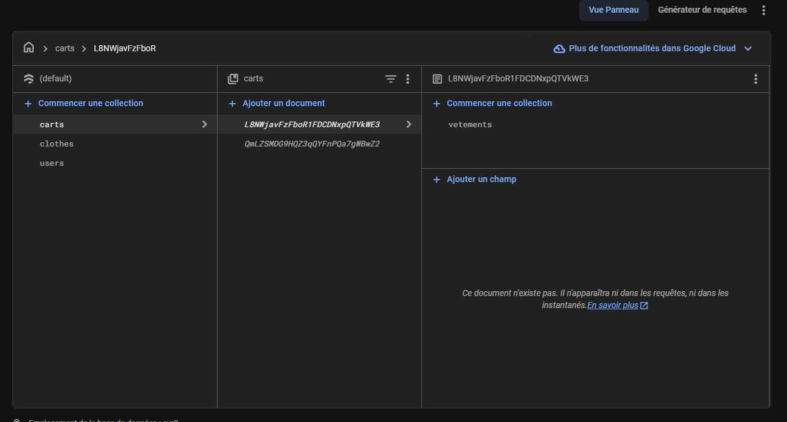

<div style="text-align: center; color: red;">
  <h1>vente_vitmentr</h1>
</div>


## Marks
you can test the AI integrated with andy images but for 3 category: 
  ---> Jeans
  ---> Jacket
  ---> T-short
  
## usename/password

login: user1@email.com<br>
password: password1

login: user2@email.com<br>
password: password2

## regle utilise en firebase 
``` 

rules_version = '2';

service cloud.firestore {
  match /databases/{database}/documents {
  function signedInOrPublic() {
      return (request.auth != null) && exists(/databases/$(database)/documents/users/$(request.auth.uid));
    }
    // Rule for the "clothes" collection
     match /carts/{userId}/vetements/{vetementId} {
      allow write: if request.auth != null 
                    && exists(/databases/$(database)/documents/users/$(request.auth.uid))
                    && exists(/databases/$(database)/documents/users/$(userId))
                    && userId == request.auth.uid
                    && exists(/databases/$(database)/documents/clothes/$(vetementId));
      allow read: if request.auth != null 
                    && exists(/databases/$(database)/documents/users/$(request.auth.uid))
                    && exists(/databases/$(database)/documents/users/$(userId))
                    && userId == request.auth.uid
                    
                    
    }
    
    match /clothes/{document=**} {
      // Allow read and write if the user's UID exists in the "users" collection
      allow read, write: if signedInOrPublic();
    }
    
    match /users/{userId} {
    	allow read, write: if request.auth != null 
                    && exists(/databases/$(database)/documents/users/$(request.auth.uid))
                    && exists(/databases/$(database)/documents/users/$(userId))
                    && userId == request.auth.uid
    }
  }
}

``` 

## Architecuture utilise
Design pattern MVVM



## Firebase





